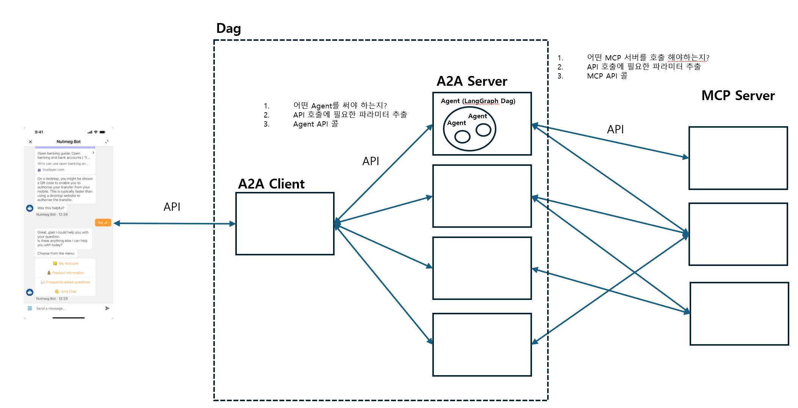

```markdown
# 프로젝트 설명

이 프로젝트는 a2a_mcp 구현과 mcp_demo 구현 예제를 포함합니다. 
- `a2a_mcp_demo`: 다양한 에이전트(basic, marketing, stock, survey)와 툴(ad_minder, news)을 포함한 MCP 클라이언트/서버 구현
- `mcp_demo`: 뉴스/날씨 서버와 클라이언트를 포함한 간단한 MCP 데모

## 프로젝트 구조

├── a2a_mcp_demo
│   ├── a2a_client.py
│   ├── agents
│   │   ├── agent_base.py
│   │   ├── basic_agent
│   │   │   ├── agent.py
│   │   │   └── card.json
│   │   ├── marketing
│   │   │   ├── agent.py
│   │   │   └── card.json
│   │   ├── stock_agent
│   │   │   ├── agent.py
│   │   │   └── card.json
│   │   ├── survey_agent
│   │   │   ├── __pycache__
│   │   │   │   └── agent.cpython-310.pyc
│   │   │   ├── agent.py
│   │   │   └── card.json
│   │   └── utilities_agent
│   │       ├── agent.py
│   │       └── card.json
│   ├── app.py
│   ├── email.ipynb
│   ├── run_client_server.sh
│   └── tools
│       ├── ad_minder
│       │   ├── ad_minder.py
│       │   ├── manifest.json
│       │   └── run_ad_minder_server.sh
│       ├── mail_sender
│       │   ├── config.json
│       │   ├── mail_sender.py
│       │   ├── manifest.json
│       │   └── run_mail_sender_server.sh
│       ├── mcp_servers.json
│       └── news
│           ├── manifest.json
│           ├── news.py
│           └── run_news_server.sh
├── langgraph_tutorial.ipynb
├── mcp_demo
│   ├── __pycache__
│   │   ├── news.cpython-310.pyc
│   │   └── weather.cpython-310.pyc
│   ├── app.py
│   ├── client.py
│   ├── news.py
│   ├── run_client_server.sh
│   ├── run_news_server.sh
│   ├── run_weather_surver.sh
│   └── weather.py
├── mcp_test.ipynb
├── meta
│   └── overview.png
├── README.md
├── requirements.txt
└── test.py
```

## Agent card.json
```json
{
  "schema_version": "1.0",
  "name": "UtilitiesAgent",
  "description": "사용자의 자연어 요청을 분석해 적합한 MCP 도구를 선택/호출합니다. 이메일 발송, 회의록 요약, 일정/알림 안내, 간단한 변환·조회 등 유틸리티 작업을 담당합니다.",
  "version": "0.2.0",
  "capabilities": [
    {
      "name": "execute",
      "description": "자연어 유틸리티 실행 요청을 받아 적합한 MCP 도구를 판단하여 업무를 수행합니다.",
      "parameters": {
        "type": "object",
        "properties": {
          "user_input": { "type": "string", "description": "자연어 유틸리티 실행 요청 및 응답" }
        },
        "required": ["user_input"]
      }
    }
  ],
  "metadata": {
    "keywords": ["utilities", "메일", "email", "전송", "회의록", "요약", "알림", "일정", "변환", "조회"],
    "tools": ["mail_sender"]
  }
}
```

## menifest.json (MCP-tool)
```json
{
  "server": "ad_miner",
  "tools": [
    {
        "name": "performance",
        "description": "배너 번호와 기간(시작/종료)을 입력받아 해당 배너의 실적(노출/클릭/CTR)을 반환합니다.",
        "parameters": {
            "type": "object",
            "properties": {
                "bnnr_id": {"type": "integer", "description": "배너 번호"},
                "start_date": {"type": "string", "description": "조회 시작일 (YYYY-MM-DD)"},
                "end_date": {"type": "string", "description": "조회 종료일 (YYYY-MM-DD)"}
            },
            "required": ["bnnr_id", "start_date", "end_date"]
        }
    }
  ]
}

```

## 실행 방법
```bash
sh a2a_mcp_demo/run_client_server.sh # client(Chatbot)
sh a2a_mcp_demo/tools/news/run_ad_minder_server.sh # 마케팅 배너 실적 조회 Tool
sh a2a_mcp_demo/tools/ad_miner/run_news_server.sh # 뉴스종목 검색 Tool
sh a2a_mcp_demo/tools/ad_miner/run_mail_sender_server.sh # 메일 전송 Tool
```

## 시스템 개요

```
